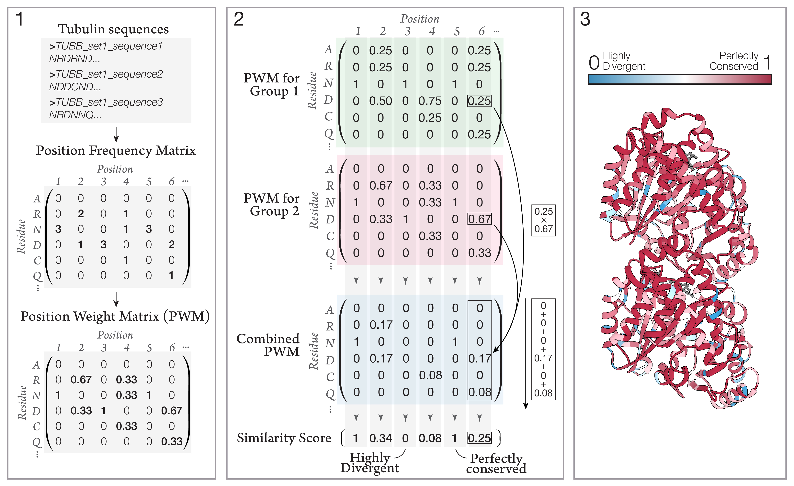

# Vectors between aligned PFs

## Input

- 2 fasta files, each with sequences of interest (e.g. all "canonical" beta-tubulins in one and C. elegans beta-tubulins in another). All sequences have to be the same length, which can be achieved by running MAFFT on all the sequences first:
`mafft-linsi  --retree 2 --inputorder "all-beta.fasta" > "all-beta-gaps.fasta"`
and then splitting them up.

## Output
- Attribute file with similarity scores of each residue readable by Chimera. A separate file for each sequence in the input is generated to account for differences in sequences.

## Loading attribute files in Chimera
- `cd /path/to/similarity/files`
- `defattr name-of-beta-similarity.txt spec #0`

