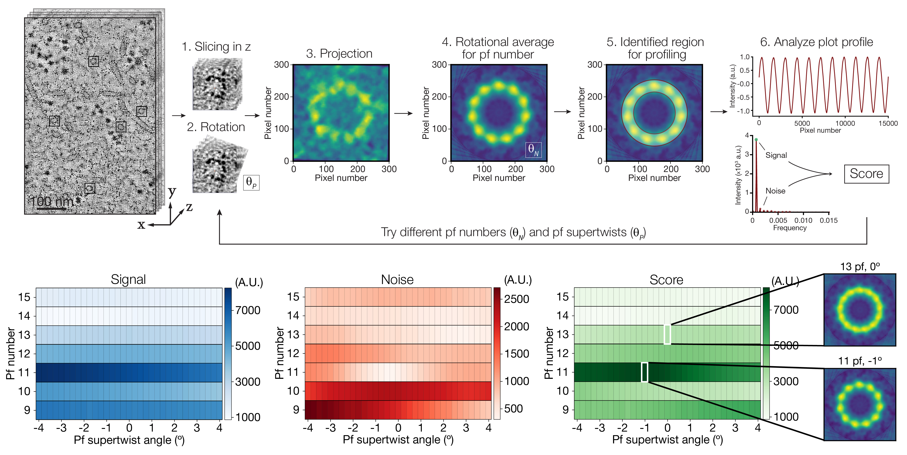

# Vectors between aligned PFs

## Input

- Directory holding separate numbered folders (e.g. "1", "2", "3", etc.), each with a file called cc.tif, which is a stack of slices through a microtubule. Consider doing fine-tuning of slice centering in FIJI first

## Run

- "MT Tomo PF Number Finder" is run first to generate all Amplitude, Noise, And Score matrices. "MT Tomo PF Number Analyze Results" is run after to find best scores and show best projections.