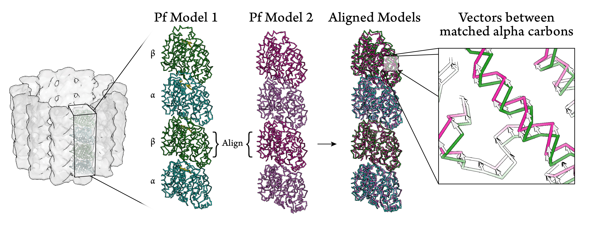

# Vectors between aligned PFs

##Input

- 2 PDB files of 2-dimer pfs: Order of chains has to be bottom(alpha)-to-top(beta) monomer, and identical for both PDB files (see example)
- 2 Alignment files matching residues of (1) alpha-tubulin and (2) beta-tubulin. Use "align chain sequences" from Chimera to generate ".asc" file. Edit the file such that it only has one alignment and no headers (see example)

##Output
- Chimera-readable ".bild" file with vectors

##Example run:
python Tubulin_Vectors.py --pdb1 PF-3JAT.pdb --pdb2 PF-3JAS-ali-to-3JAT-bottombeta.pdb --a 3JAT-to-3JAS-alignment-alpha.asc --b 3JAT-to-3JAS-alignment-beta.asc